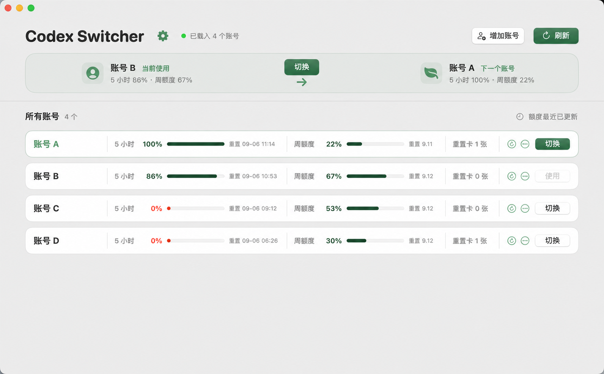

<h1 align="center">
  
</h1>

  v0.1 · English · <a href="README_zh.md">中文</a>

## Overview

Codex Switcher is a macOS app for managing multiple Codex accounts. It brings account usage into one place and lets you switch accounts when needed.

The app shows your current account, remaining usage, and reset times on a single screen. It also recommends the next available account based on current usage, so you do not need to sign in to each account and compare them manually.

## Download

[Download v0.1](https://github.com/justamanm/codex-switcher/releases/download/v0.1/Codex-Switcher.dmg), open it, and drag Codex Switcher into the Applications folder. Development builds are also available from the [rolling latest release](https://github.com/justamanm/codex-switcher/releases/tag/latest).

The current build uses an ad hoc signature. On first launch, control-click the app and choose **Open**. If macOS still blocks it, open **System Settings → Privacy & Security** and choose **Open Anyway**.

## What it solves

When several accounts are used in rotation, it can be difficult to remember which account is active, which accounts still have usage available, and when their limits reset. Codex Switcher presents this information together and makes account selection more direct.

It is useful when you:

- Manage multiple Codex accounts.
- Choose accounts based on their remaining usage.
- Want to reduce repeated sign-ins and manual usage checks.
- Need a clear view of 5-hour usage, weekly usage, reset times, and reset cards.

## Features

- View every added account and its usage status in one place.
- Clearly identify the account currently in use.
- See 5-hour usage, weekly usage, reset times, and reset cards.
- Get a recommendation for the next account based on available usage.
- Switch to a selected account from the app.
- Refresh all accounts together or update one account immediately.
- Automatically refresh an account after its usage resets.
- Add accounts and give them recognizable aliases.
- Keep existing data visible if one account fails to refresh.
- Manage accounts that are no longer needed.
- Use Chinese or English, or follow the macOS system language.

## How to use it

Open the app to see the current account, the recommended next account, and the usage status of every account. You can follow the recommendation or select another account from the list.

When adding an account, the app uses ChatGPT when it is installed. If only Codex CLI is available, it asks you to run `codex login` in Terminal and detects the new account after sign-in. If you cancel, it restores the account that was active before you started.

## Usage notes

- Adding an account requires either ChatGPT or Codex CLI. If neither is installed, Codex Switcher stops before changing any account files.
- When Codex CLI is installed, exit its running sessions before switching or adding an account, then reopen it when prompted.
- Existing accounts can still be switched without ChatGPT installed; automatic ChatGPT reopening is skipped.
- Keep Codex Switcher open while adding an account so it can complete sign-in or restore the previous account after cancellation.
- Account information and credentials stay on your Mac. The app does not display identity tokens.
